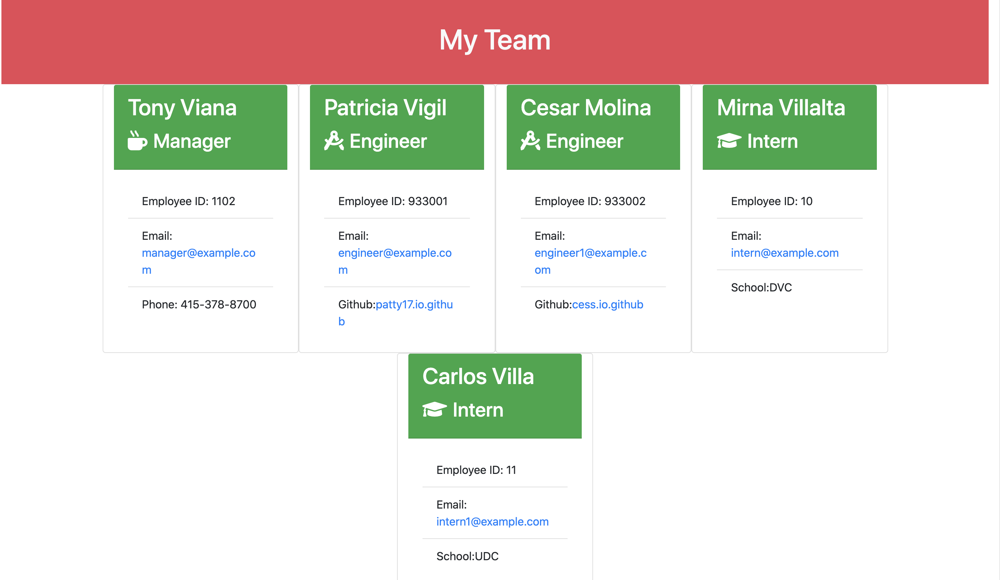

# My Team
By Mario Viana

## Description!!!

This program was designed for those people who want to make a website of the entire hierarchy in their company, this works by collecting the information of all the people who are within it. The data that is collected is the most basic data that a person you can  ask, for example: Name, id, phone, profession, email, github and etc ... The program is run using our bash "Node index" this designed for the end user to run from a screen. Using our tester we have passed all the required tests (Run: npm test), so that our code is clean.

## Please click in the link below!!!
[Video explanation to create My-Team](https://drive.google.com/file/d/1SKnf5dsZZ0TStBw6AsrTX9DPmYh77ama/view)

## Programming Languages!!!

    * JavaScript
    * Node JS
    * HTML
    * Bootstrap

Thanks to everyone who helped develop this program, TA's, instructors, students, friends, and family for giving me this valuable time to learn something new!!!
